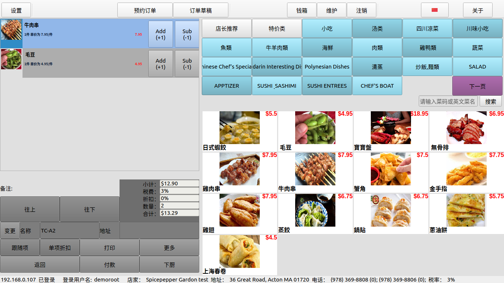
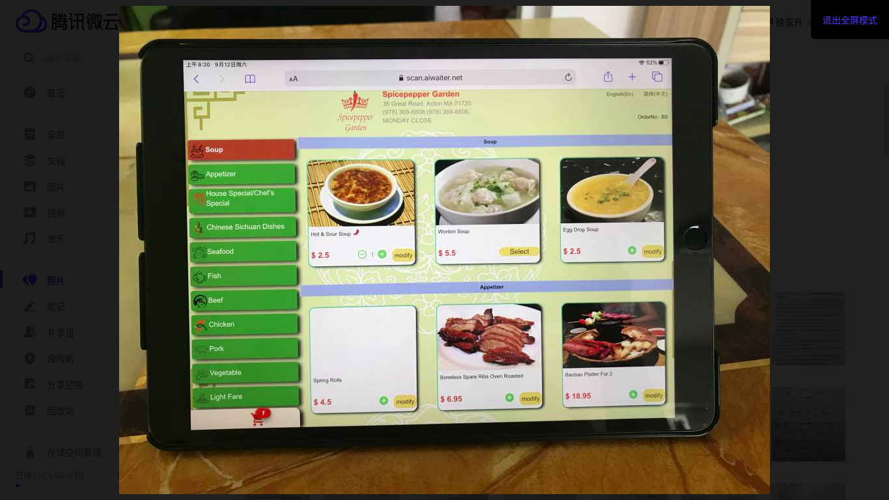

# amp
app for POS with mobile 互联网+POS

基于美国中餐馆传统POS软件框架进行架构升级

# 硬件架构已支持: 
**X86 (windows 10, ubuntu 18.04)**
**arm64-v8a (android)**

# 系统软件架构：
**1。支持云服务**
**2。支持本地服务**

# 功能上已实现：
**1。前台堂吃点餐** 
**2。前台外等/外送点餐** 
**3。前台电话接入点餐** 
**4。支持线上订单接入** 
**5。桌台预约** 
**6。堂吃拼桌** 
**7。菜品分类** 
**8。菜类自定义** 
**9。菜品模糊查询** 
**10。各州税费定制** 
**11。购物车单菜项打折** 
**12。购物车单菜项口味设置** 
**13。购物车整单打折** 
**14。购物车整单口味设置** 
**15。购物车整单拆单设置** 
**16。购物车订单类型变更** 
**17。支持信用卡支付** 
**18。支持现金支付** 
**19。支持小费录入** 
**20。支持菜品管理（支持售罄，特价，和推荐设置）** 

POS点餐界面  
PAD堂吃移动点餐界面  

# 更多功能及在线演示，请关注微信公主号：智慧POS服务  
## 或 skype: 7188785818

